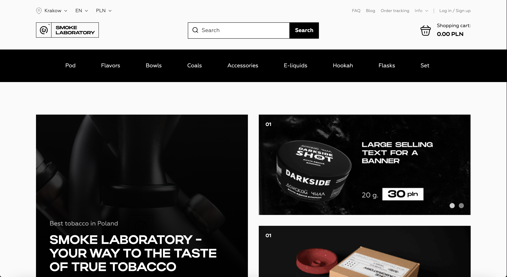
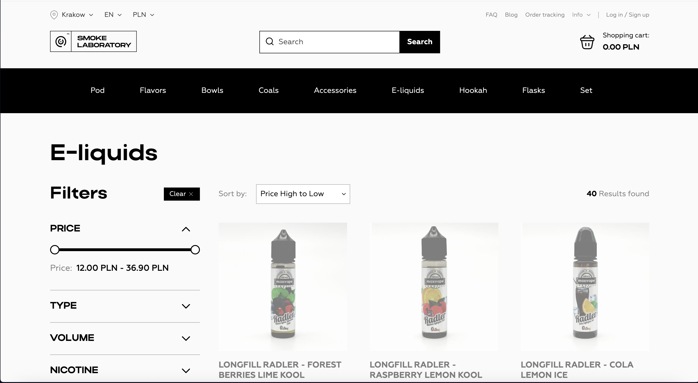
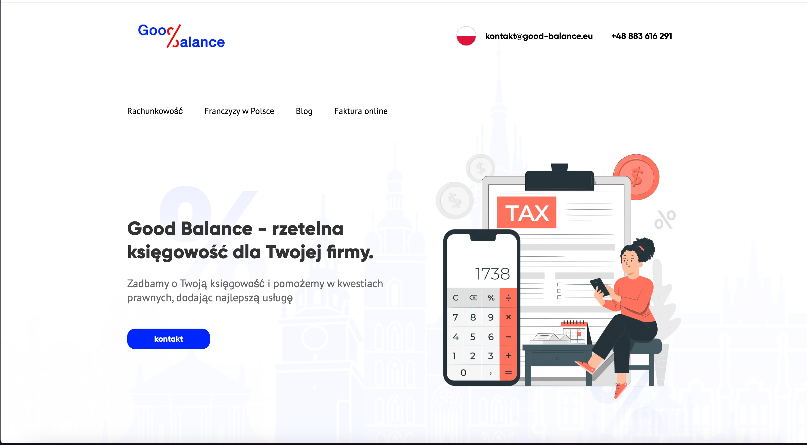
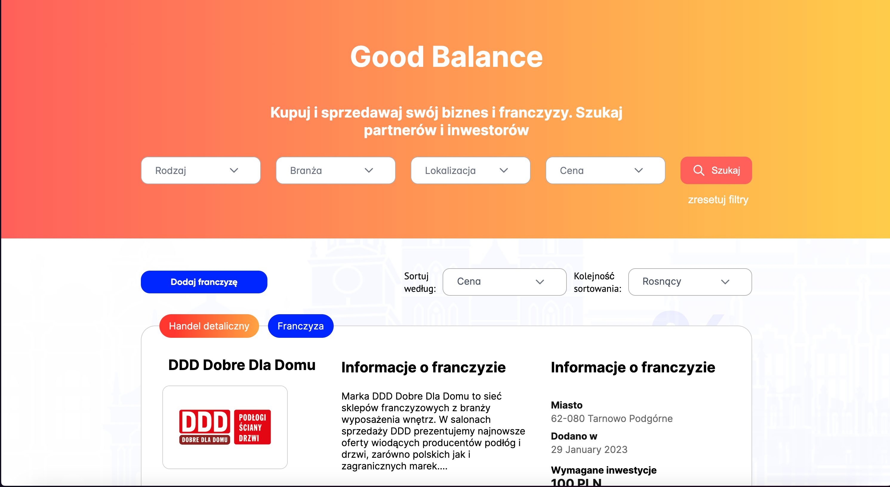
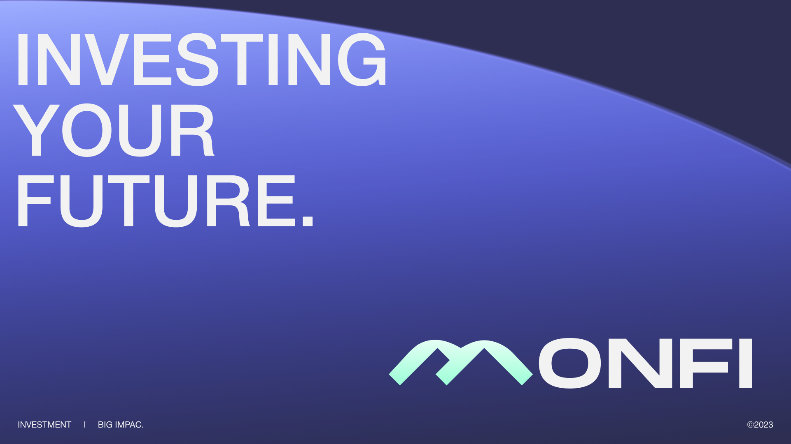
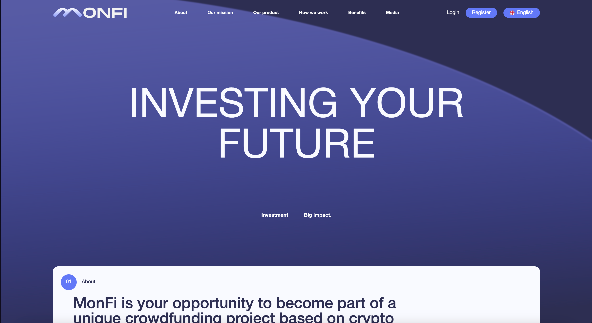
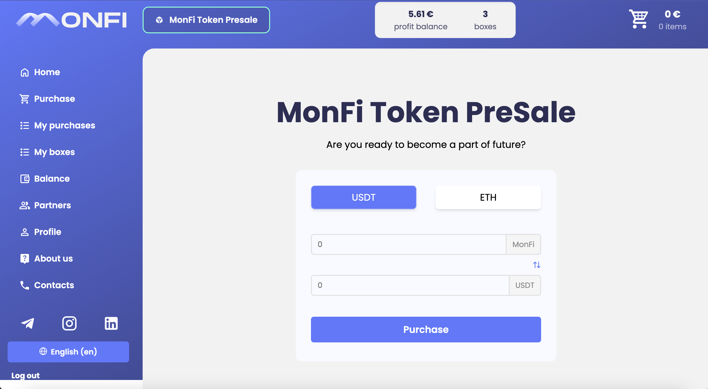

# Inc-dev portfolio

## Cases

### Smoke Laboratory

[Smoke Laboratory](https://smokelab.pl) - e-commerce website that is focused on selling hookah tobacco, hookah, electronic smoking devices and liquids for them.

Development of this project differs much from the standard e-commerce webside development approach as flexible and highly customizable platform was one of the core requirements. We took it seriously developing own admin panel (or CMS, content management system) that took that variability of scenarios of use of the website to the completely different level.

The developed design system was matched with company's style and brandbook to create a serious and modern picture.

Website home page:

Website products list page:

The design system alongside with rapid-working UI creates a beautiful image that makes client's first impression unforgettable and generates income for the website owners.

### Good Balance

[Good Balance](https://good-balance.eu) is a web platform that implements features for accounting alongside with a marketplace for business, franchise and investments finding.

The project's core point is to be very flexible and allow for future support of many different features. The task was solved by building a front-end and back-end completely from the ground-up in the way that the software is not bound by the previous functionality.

Core features of [Good Balance](https://good-balance.eu):

- Announcements publishing - a part of website that gives users the opportunity to publish an announcement of the required type in order to complete the given task more effectively   

  - **Franchise sale announcements** - selling a franchise through a website
  - **Business sale announcements** - selling a business through a website
  - **Finding investment announcements** - finding the investments for your business
- Invoice management tool - part of website that allows for quick creation and saving of invoices. It consists of two main parts:
  - **Invoice creation tool** - a tool that allows for quick building of invoices. The list of all its features is:
    - Invoice numeration
    - Multi-language invoices
    - Calculating the required VAT sum
    - Saving the seller information via the invoice cabinet
    - Multi-currency support
    - On-The-Fly invoice generation
  - **Invoice cabinet** - used to save the created invoices. Available to registered users and uses on-the-fly pdf files generation in order to achieve the task of getting the invoices in the correct form
- Blog - a page where admin can publish tips and answers, forms and documents, usefuls links and news in order for users to use

### MonFi

[MonFi](https://monfi.io) is an investment platform that is planned to revolutionize the way we use cryptocurrency and make crypto loans available to the public. 

At the current state, MonFi is only a crowdfinding platform but as its development continues, the core functionality of the platform is to be released.

MonFi case parts:

- Landing page
- Crowdfunding platform
- Token and ICO

#### Landing page

MonFi's landing page is designed and developed to match the overall stylistics and general trends in crypto.

The core function of the landing page is to describe what **MonFi** is all about and show the potential client all the opportunities they will have if they start using the company's products.

This landing takes the approach of being **simple** yet **super informative** using modern design trends such as background gradients and patterns.

Main action the user is expected to engage in is Login/Register buttons in the website header that, by clicking on them, navigate the user to the crowdfunding platform.

#### Crowdfunding platform

The crowdfunding platform's goal is to gain resources to implement the projects true functionality into life. 

It achieves its goal through **investment boxes**. Investment boxes differ by price and duration. The longer the box takes to complete - the greater the income is. This proportion creates great possibilities for possible investors and creates an opportunity for MonFi team to develop the platform using the given resources.

The platform supports payment with many crypto tokens and coins, including `USDT TRC20`, `USDT ERC20`, `BTC` and `ETH`. The payment is also achievable via `SEPA` money transfer.

The platform involves many interesting concepts. For example, investment packages can have many payouts. The app also has multi-level referral program that allows for better platform marketing.

#### Token and ICO

An interesting part of crowdfunding strategy of MonFi is Monfi token. 

The token itself operates on the `ETH` chain that gives great opportunities for investments as this chain is the most popular among the other chains.

The ICO is implemented via token presale smart contract and page on investment platform:

##### Presale smart contract 

Manages how the tokens can be purchased. It is called from the web UI using MetaMask or different MetaMask API compatible ETH web3 provider

##### Presale page

It is a small dApp placed on the crowdfunding platform and has capabilities of selling the token with either ETH or USDT ERC20.